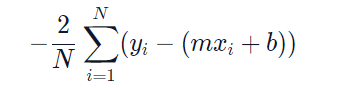

# Supervised Learning Algorithms

## Linear Regression 
Linear regression analysis is used to predict the value of a dependent variable based on the value of another independent variable. 

#### Examples of linear regression:

* The market price of a house vs. the square footage of a house. Can we predict how much a house will sell for, given its size?
* The tax rate of a country vs. its GDP. Can we predict taxation based on a country’s GDP?
* The amount of chips left in the bag vs. number of chips taken. Can we predict how much longer this bag of chips will last, given how much people at this party have been eating?

#### Points and Lines

y = mx+c 

`m` is the slope<br/>
`b` is the intercept<br/>
`y` is a given point on the y-axis, and it corresponds to a given `x` on the x-axis<br/>

#### Gradient Descent for Intercept



`N` is the number of points we have in our dataset<br/>
`m` is the current gradient guess<br/>
`b` is the current intercept guess<br/>

#### Gradient Descent for Slope


`N` is the number of points you have in your dataset.<br/>
`m` is the current gradient guess.<br/>
`b` is the current intercept guess.<br/>


## Multiple Linear Regression

Multiple Linear Regression uses two or more independent variables to predict the values of the dependent variable.

#### Multiple Linear Regression Equation
y = b + m1x1 + m2x2 + ... + mnxn   <br/>
Here, `m1`, `m2`, `m3`, … mn refer to the coefficients, and b refers to the intercept that you want to find.

#### Training Set vs. Test Set

* `Training set`: the data used to fit the model
* `Test set`: the data partitioned away at the very start of the experiment (to provide an unbiased evaluation of the model)


```
from sklearn.model_selection import train_test_split
 
x_train, x_test, y_train, y_test = train_test_split(x, y, train_size=0.8, test_size=0.2)
```
#### Multiple Linear Regression in Scikit-learn

```
from sklearn.linear_model import LinearRegression

mlr = LinearRegression()
mlr.fit(x_train, y_train) 
# finds the coefficients and the intercept value

y_predicted = mlr.predict(x_test)
```

#### Residual Analysis

One of the technique can evaluate the accuracy of our multiple linear regression model.The difference between the actual value y, and the predicted value ŷ is the `residual e`. The equation is:

` e = y - ŷ `

`sklearn`‘s `linear_model.LinearRegression` comes with a `.score()` method that returns the coefficient of determination R² of the prediction


### Logisitic Regression

### K-Neighbor-Nearest (KNN)

### Decision Tree


