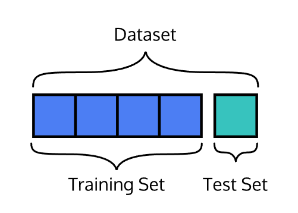

# Supervised Learning Algorithms

## Linear Regression 
`Linear regression` analysis is used to predict the value of a dependent variable based on the value of another independent variable. 

#### Examples of linear regression

* The market price of a house vs. the square footage of a house. Can we predict how much a house will sell for, given its size?
* The tax rate of a country vs. its GDP. Can we predict taxation based on a country’s GDP?
* The amount of chips left in the bag vs. number of chips taken. Can we predict how much longer this bag of chips will last, given how much people at this party have been eating?

#### Points and Lines

 

`m` is the slope 
`b` is the intercept 
`y` is a given point on the y-axis, and it corresponds to a given `x` on the x-axis 

#### Gradient Descent for Intercept

`N` is the number of points we have in our dataset 
`m` is the current gradient guess 
`b` is the current intercept guess 

#### Gradient Descent for Slope

`N` is the number of points you have in your dataset. 
`m` is the current gradient guess. 
`b` is the current intercept guess. 

## Multiple Linear Regression
`Multiple Linear Regression` uses two or more independent variables to predict the values of the dependent variable.

#### Examples of multiple linear regression
* Predicting the housing prices with many factors.
* Medical research to analyze the relationship between a dependent variable and various independent variables

#### Multiple Linear Regression Equation
 

Here, `m1`, `m2`, `m3`, … mn refer to the coefficients, and `b` refers to the intercept that you want to find.

#### Training Set vs. Test Set

* `Training set`: the data used to fit the model
* `Test set`: the data partitioned away at the very start of the experiment (to provide an unbiased evaluation of the model)

#### Residual Analysis

One of the technique can evaluate the accuracy of our multiple linear regression model.The difference between the actual value y, and the predicted value ŷ is the `residual e`. The equation is:

` e = y - ŷ `

## Logisitic Regression
`Logistic regression` is a supervised machine learning algorithm that predicts the probability, ranging from 0 to 1, of a datapoint belonging to a specific category, or class.

#### Examples of logistic regression
* Disease identification — Is a tumor malignant?
* Real or spam email?
* Customer conversion — Will a customer arriving on a sign-up page enroll in a service?

#### Logit Link Function

#### Classification Threshold 
Once we have this probability, we need to make a decision about what class a datapoint belongs to. This is where the `classification threshold` comes in! 

## K-Neighbor-Nearest (KNN)
`K-Nearest Neighbors (KNN)` is a classification algorithm. The central idea is that data points with similar attributes tend to fall into similar categories.

#### Examples of K-Neighbor-Nearest (KNN)
* Customer Segmentation: Group customers with similar characteristics together.
* Anomaly Detection: KNN can be used to detect anomalies or outliers in a dataset. 
* Breast Cancer Classifier

#### Distance Formula (Euclidean Distance)
`Euclidean Distance` was used to find the distance between each points and find the nearest point.

#### Three steps of the K-Nearest Neighbor Algorithm:
1. Normalize the data
2. Find the k nearest neighbors
3. Classify the new point based on those neighbors

## Decision Tree
Decision trees are machine learning models that try to find patterns in the features of data points.  
About the example below, the red points represent students that didn’t get an A on a test and the green points represent students that did get an A on a test. 

#### Examples of K-Neighbor-Nearest (Decision Tree)
* Credit Risk Assessment: Decision trees can be used to assess the credit risk of individuals or businesses.
* Disease Diagnosis: In the field of healthcare, decision trees can aid in diagnosing diseases. 
* Product Recommendation: Decision trees can be utilized in recommendation systems. 

#### Gini Impurity
`Gini impurity` is a measure of the impurity or disorder in a set of data used in the context of decision tree algorithms. It quantifies how well a randomly selected element from a set would be classified incorrectly if it were randomly labeled according to the distribution of labels in the set.  
  
where `p(i)` represents the probability of an element.

